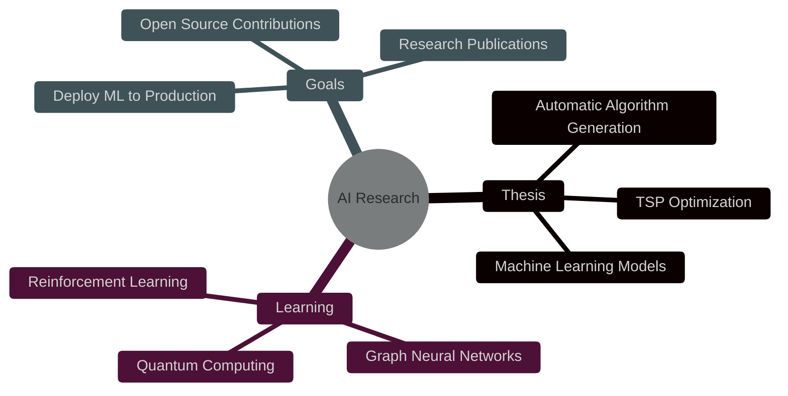

<!-- Header animado con gradiente púrpura -->

  

<!-- Alice in Wonderland themed greeting -->

  

<h1 align="center">
  
  Welcome to my Wonderland 
  
</h1>

<!-- Typing SVG -->

  

<!-- Elegant purple divider -->

  

<!-- About Me Section con diseño mejorado -->

  <table>
    <tr>
      <td width="50%">
        
###  About Me

🎓 **Computer Science Engineering Student**  
@ Universidad de Santiago de Chile (USACH)

🤖 **AI Manager** | Leading AI/ML initiatives  
🧬 **Research Focus** | Automatic Algorithm Generation  
🔬 **Deep Learning** | Neural Networks & RL  
👩‍🏫 **Educator** | Programming & Robotics  
💜 **Passionate** | Machine Learning & Optimization  

      </td>
      <td width="50%">
        
      </td>
    </tr>
  </table>

<!-- Purple aesthetic line -->

  

<!-- Featured Projects with Cards Style -->
## ✨ Featured Projects

  
| 🎭 Project | 💭 Description | 🔮 Tech Stack | 🔗 Links |
|---------|-------------|------------|-------|
| **🧬 Thesis - GAA** | Automatic Algorithm Generation for TSP using ML | Python • TensorFlow • GA | 🔒 Private |
| **🤖 Machine Learning** | Advanced ML implementations & experiments | Python • Jupyter • scikit-learn |  |
| **⚙️ Microservices** | Distributed system with Spring Cloud | Java • Spring Boot • Docker |  |
| **💫 BotoneraGeko** | Enterprise Queue Management System | C# • .NET • Socket.IO | 🔒 Private |
| **🔮 Parallel Systems** | High-performance computing implementations | C++ • MPI • OpenMP |  |

<!-- Tech Skills with Better Organization -->
## 🎨 Tech Palette

### 🤖 **Artificial Intelligence & Machine Learning**

### 💻 **Languages**

### ☁️ **Cloud & DevOps**

<!-- Magical purple separator -->

  

<!-- GitHub Stats with purple theme -->
## 📊 GitHub Magic

  
  

  

<!-- Activity Graph Purple -->

  

<!-- Purple line -->

  

<!-- Trophies -->
## 🏆 Achievement Showcase

  

<!-- Current Focus with elegant design -->
## 🔮 Current Quest

<!-- Snake with purple theme -->
## 🐍 Contribution Journey

  <picture>
    <source media="(prefers-color-scheme: dark)" srcset="https://raw.githubusercontent.com/platane/platane/output/github-contribution-grid-snake-dark.svg">
    <source media="(prefers-color-scheme: light)" srcset="https://raw.githubusercontent.com/platane/platane/output/github-contribution-grid-snake.svg">
    
  </picture>

<!-- Purple aesthetic separator -->

  

<!-- Connect Section Elegant -->
## 💌 Down the Rabbit Hole

  

  
  
  
  
  
  

<!-- Visitor Count -->

  
   
  
  
  
    
  
  ### ✨ *"Why, sometimes I've believed as many as six impossible things before breakfast."* ✨
  *— Lewis Carroll, Alice in Wonderland*
  

<!-- Footer with purple gradient -->

<!-- Hidden Easter Egg -->
<!-- 
  🎩🐰 "We're all mad here. I'm mad. You're mad." 🎩🐰
  Found the Mad Hatter's secret? Send me a message with 🎩 
-->
